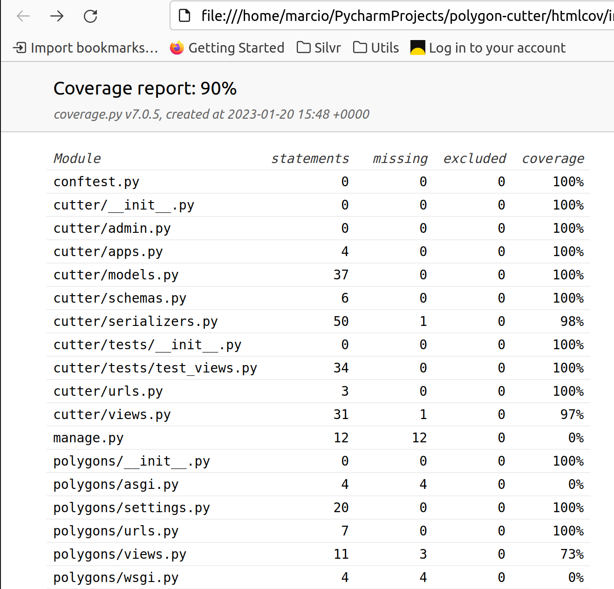
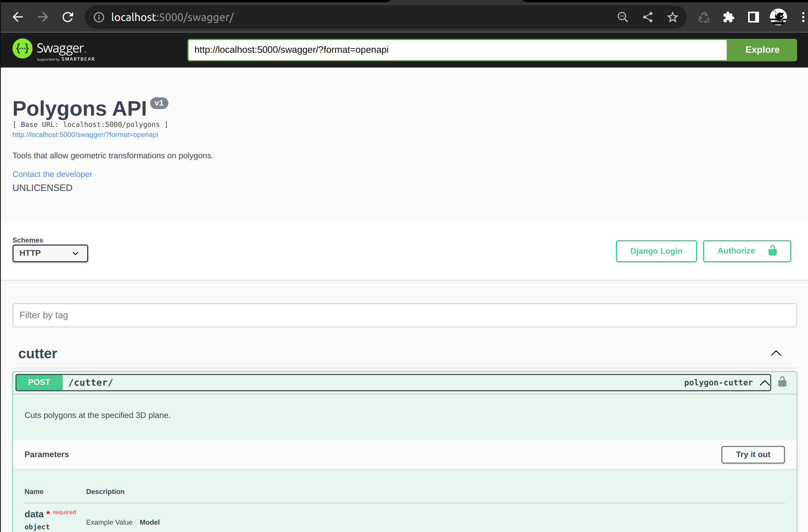
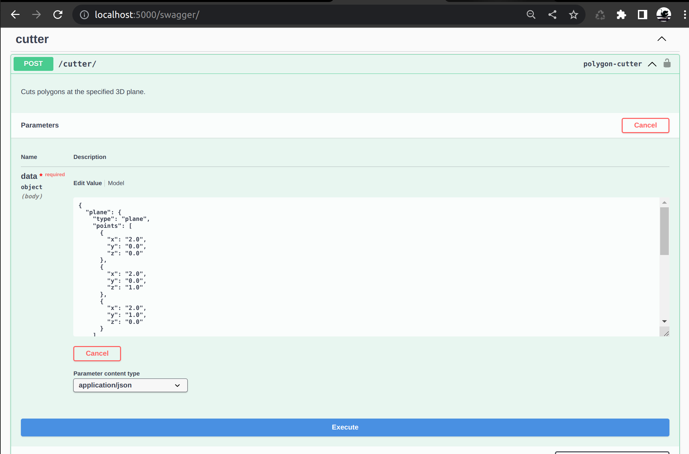
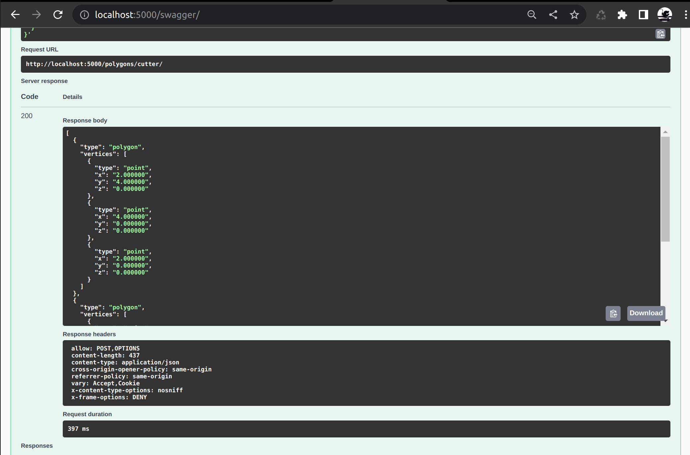

# ModuGen Backend Coding Challenge

## Overview

This project is meant as a vehicle to showcase some of my skills developing back-end projects. 

Consists of a REST API that allows cutting a given polygon at specified 3D planes.

The complete requirements are available [here](./requirements/BackendCodingChallenge.pdf).

## Design

The REST API has been built using the following main components:

- [Django](https://www.djangoproject.com/).
- [Django REST Framework](https://www.django-rest-framework.org/).
- [DRF-YASG](https://drf-yasg.readthedocs.io/en/stable/) (Swagger/OpenAPI documentation).

The computations necessary to perform the geometric operations use the [Sympy](https://www.sympy.org/en/index.html) package.

This project does define "models", however these are not standard Django database models.

To facilitate serialization, "models" were defined extending existent "geometric entities" from Sympy (that's their own lingo).

Each model has a corresponding serializer. The serializers perform two tasks:

- Parse the input payload (i.e. Polygon and Plane for the cutting operation), i.e., JSON and produce "model" objects.
- Serialize the "model" objects back to JSON.

In principle, should be possible to preserve the models interface, but use some other package
than Sympy to perform the geometric operations (this design provides some de-coupling from the
geometry library). However, the current models are very close to Sympy's geometric entities.

Sympy has been chosen for the following reasons:

- It's simple to use.
- Offers polygon cutting out-of-the-box.

We only require two Sympy standard operations to perform a cutting:

- Intersect the polygon's plane and the cutting plane (the result is a line).
- Use the intersection line to cut the polygon. 

The result is a list of polygons (sorted from up to down, and right to left, relative to the cutting line).

Sympy does have some limitations though:

- It does not quite work for concave polygons (it doesn't throw an error, but the result is incorrect).
- Polygons can only be defined in the 2D space.
- Makes a distinction between triangles and polygons, which made the models a bit more complicated that they needed to be.

Such limitations have been dealt with by validating the input polygon and plane:

- Polygons can only be defined in the YX plane.
- The polygons need to be convex.
- The cutting plane need to be perpendicular to the polygon's plane.

These validations can be seen in unit tests (refer to tests for more information).

## TODO
 
Given the requirements, this API does not really require a database, however, on a production setup would be advisable to:

- Use a real database.
- Set up a form of authentication (e.g., token authentication).

The way we compute the cuts does not really require that the input plane is orthogonal to the polygon's plane.

However, making this assumption makes the definition of the request body JSON and
the expected result polygons easier. For this reason, we have added this constraint to the input.

This assumption also would allow the user to define the plane by providing 
an anchor point and an angle, e.g.:

```json
{
  "plane": {
    "anchor": {
      "type": "point",
      "x": "0.0",
      "y": "0.0",
      "z": "0.0",
    },
    "tilt": "30.0"
  }
}
```

It arguably would make more convenient for the user to define the cutting plane in this manner.

## Creating a Development Environment
### Installing Dependencies

Dependencies are managed using [Poetry](https://python-poetry.org/).

On Linux, you may install it by running the following command:

```commandline
curl -sSL https://install.python-poetry.org | python3 -
export PATH=/home/$USER/.local/bin/poetry:$PATH
```
For a different O.S., follow the instructions [here](https://python-poetry.org/docs/).

You may also need other O.S. dependencies, e.g., on Linux:

```commandline
sudo apt-get install binutils libproj-dev gdal-bin
```

Now install all Python dependencies:

````commandline
poetry install --with=dev
````

This will create a virtual environment for the project, which needs to be activated:

```commandline
source .venv/bin/activate
```

This project was developed using Python 3.10.

### Running Tests

```commandline
pytest -v
```

You should see an output similar to this:

```commandline
cutter/tests/test_views.py::PolygonCutterViewTest::test_concave_polygon PASSED                              [ 10%]
cutter/tests/test_views.py::PolygonCutterViewTest::test_edge_cut_vertical PASSED                            [ 20%]
cutter/tests/test_views.py::PolygonCutterViewTest::test_inside_cut_horizontal PASSED                        [ 30%]
cutter/tests/test_views.py::PolygonCutterViewTest::test_inside_cut_vertical PASSED                          [ 40%]
cutter/tests/test_views.py::PolygonCutterViewTest::test_inside_cut_vertical_triangle PASSED                 [ 50%]
cutter/tests/test_views.py::PolygonCutterViewTest::test_invalid_request_body_disobeys_schema PASSED         [ 60%]
cutter/tests/test_views.py::PolygonCutterViewTest::test_invalid_request_body_missing_data PASSED            [ 70%]
cutter/tests/test_views.py::PolygonCutterViewTest::test_outside_cut_vertical PASSED                         [ 80%]
cutter/tests/test_views.py::PolygonCutterViewTest::test_outside_xy_plane_polygon PASSED                     [ 90%]
cutter/tests/test_views.py::PolygonCutterViewTest::test_plane_not_orthogonal_to_polygon PASSED              [100%]
```

You may also change the tests logging level:

```commandline
pytest -s -v --log-cli-level=DEBUG
```

For debugging purposes, we are printing all API responses on the DEBUG log level.

### Running Locally

You may start the service locally by running the following command:

```commandline
python ./manage.py migrate
python ./manage.py collectstatic
python ./manage.py runserver
```

### Coverage Reports

You also can produce coverage reports:

```commandline
pytest --cov=. --cov-report=html
```

Results will be available inside the folder [./htmlconv](./htmlconv):



### Formatting and Linting

Formatting is performed using [black](https://github.com/psf/black), [isort](https://pycqa.github.io/isort/), and [autoflake](https://github.com/PyCQA/autoflake).

Configuration for these can be found in the file [./pyproject.toml](./pyproject.toml).

Typing is checked using [mypy](https://mypy-lang.org/).

We are ignoring typing for Django generated files (e.g., migration folders, `settings.py`, `manage.py`) and external packages.

### Custom Honcho Commands

Shortcuts to all commands used in the projects are available through [Honcho](https://honcho.readthedocs.io/en/latest/).

| Command     | Description                                                                                                      |
|-------------|------------------------------------------------------------------------------------------------------------------|
| service     | Runs service using [UWSGI](https://uwsgi-docs.readthedocs.io/en/latest/) (meant to be used by the Docker image). |
| format      | Formats code.                                                                                                    |
| check       | Checks formatting and typing (meant to be used by CI/CD pipelines).                                              |
| test        | Runs all tests.                                                                                                  |
| coverage    | Generates coverage reports.                                                                                      |
| runserver   | Runs the service in development mode.                                                                            |
| migrate     | Runs Django migrations.                                                                                          |


## Running the API with Docker

You may run the application using docker, without setting up a development environment:

```commandline
docker build . -t polygon-service
docker run --name polygon-service -p 127.0.0.1:5000:5000/tcp -t polygon-service
```

You may stop the service by running the following command:

```commandline
docker stop polygon-service
```

The application will be available through your browser: [http://localhost:5000/](http://localhost:5000/).

You may use the OpenAPI page (default view) to send requests:



There's already an example setup for the OpenAPI page (a 4x4 isosceles triangle next to the origin):





However, it's also possible to call the API directly using [curl](https://curl.se/) or some other HTTP client.
